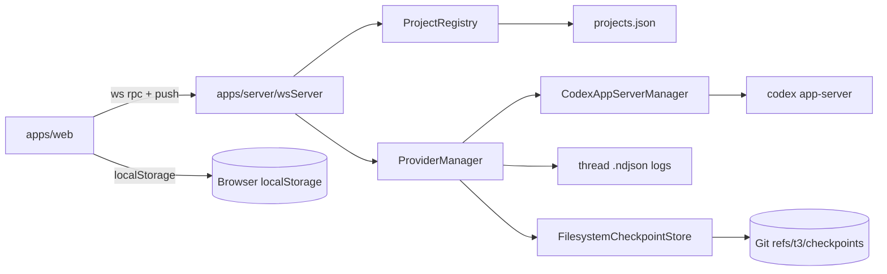
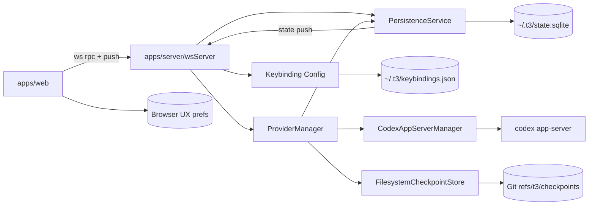
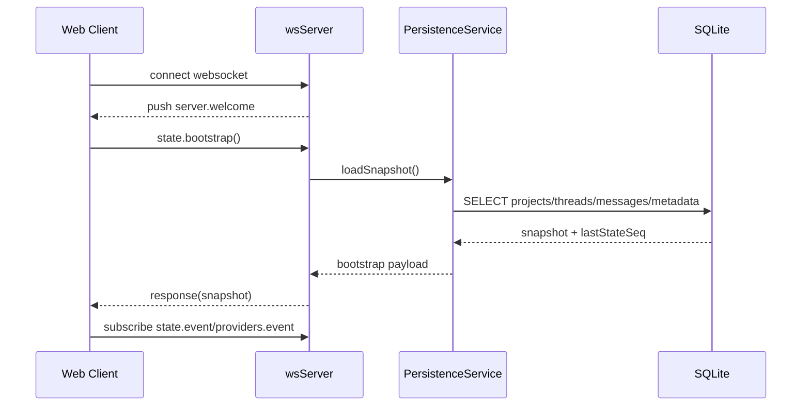
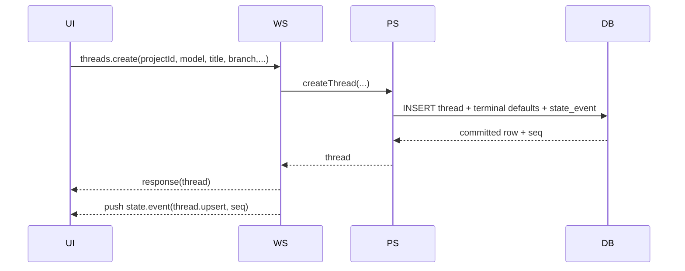
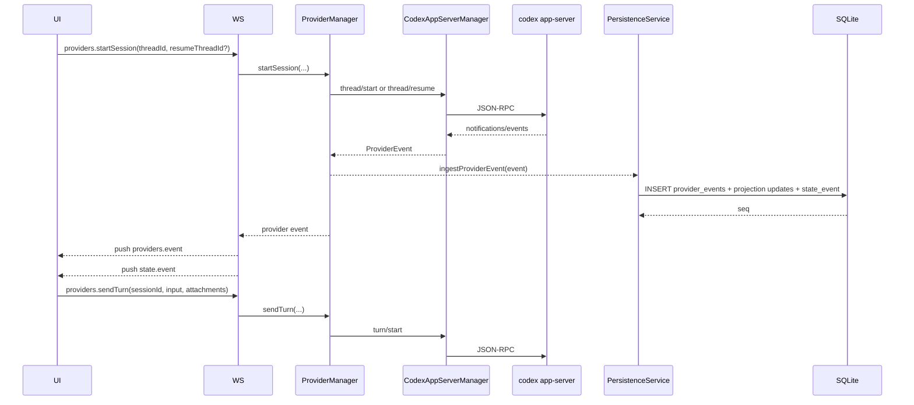
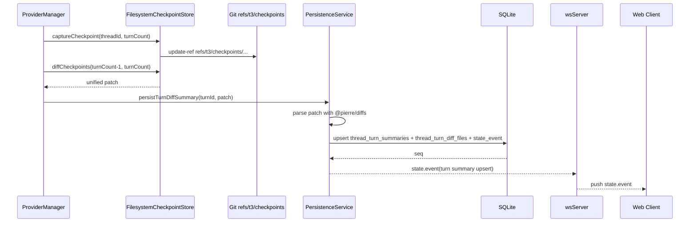

# Plan: Centralize Core Persistence in SQLite (`~/.t3/state.sqlite`)

## Summary
Move durable core app state out of renderer `localStorage` and into a centralized SQLite database at `~/.t3/state.sqlite`, while keeping machine-level editable config in JSON (keybindings) and browser UX preferences in browser-scoped state by default.

This plan preserves existing checkpoint patch storage in Git (`refs/t3/checkpoints/...`) and adds optional checkpoint diff summaries in SQLite (parsed via `@pierre/diffs`) for fast UI metadata rendering.

## Why This Revamp
Current persistence is split across multiple stores:

- Renderer core state in `apps/web/src/store.ts` (`localStorage`, key `t3code:renderer-state:v7`)
- Server project registry in `~/.t3/userdata/projects.json` (`apps/server/src/projectRegistry.ts`)
- Provider thread event logs in `.logs/threads/*.events.ndjson` (`apps/server/src/providerManager.ts`)
- Terminal history in `.logs/terminals/*.log` (`apps/server/src/terminalManager.ts`)
- Keybindings in `~/.t3/keybindings.json` (`apps/server/src/keybindings.ts`)

This produces a split-brain model (client-local canonical thread/message state, server-local provider runtime state), weak multi-window consistency, and fragile reconnect/restart behavior.

## Goals
1. Make SQLite the canonical durable store for core app entities:
   - projects
   - threads
   - messages
   - turn/checkpoint diff metadata (summary only)
2. Keep checkpoint patch contents in Git only.
3. Keep machine-level editable config in JSON files (keybindings), and keep browser UX preferences browser-scoped by default.
4. Make server authoritative for durable state; client becomes a cache/subscriber.
5. Support reliable reconnect/catch-up without `localStorage`.

## Non-Goals
1. Replacing Git checkpoint storage with DB blob storage.
2. Persisting raw terminal output into SQLite (keep file-based terminal history for now).
3. Supporting provider implementations beyond current Codex flow in this revamp.
4. Full event-sourcing rewrite of all UI state in v1.

## Data Classification and Storage Policy
| Data class | Examples | Store | Notes |
| --- | --- | --- | --- |
| Core durable app data | projects, threads, messages, thread metadata, turn summaries | SQLite (`~/.t3/state.sqlite`) | Canonical source of truth |
| Checkpoint patch content | unified diff between checkpoints | Git refs (`refs/t3/checkpoints/...`) | Existing `FilesystemCheckpointStore` remains |
| Checkpoint metadata | changed files, +/- per file, checkpoint turn mapping | SQLite | Derived from Git diff + `@pierre/diffs` |
| Machine-level editable config | keybindings | `~/.t3/keybindings.json` | Existing behavior, stays human-editable |
| Browser-scoped UX preferences | theme, preferred editor, last-invoked script by project | Browser storage (currently `localStorage`) | Not canonical app data; per-browser behavior |
| Volatile runtime state | active websocket connections, in-flight turn status, pending approvals | Memory | Rebuilt from runtime/provider events |

## Preference Scope Clarification
1. `project.scripts` belongs to core app data and is persisted in SQLite with the project record.
2. `script preference` means UX memory only, specifically the current `t3code:last-invoked-script-by-project` map used to preselect/run convenience actions.
3. Theme/editor/script-preference keys are per-browser UX and are intentionally separate from shared project/thread/message data.
4. Runtime mode default (`full-access` vs `approval-required`) should be treated as UX preference by default unless we explicitly decide it is a machine policy.

## Current vs Target Architecture
### Current (simplified)

### Target

Provider remains the runtime execution engine. PersistenceService becomes the durable state authority and broadcaster.

## Core Domain Model (SQLite)
Use strict schema + migrations (e.g. `PRAGMA user_version` or migration table), WAL mode, and transactional writes.

### Proposed tables
1. `projects`
   - `id TEXT PRIMARY KEY`
   - `cwd TEXT NOT NULL UNIQUE` (normalized)
   - `name TEXT NOT NULL`
   - `model TEXT NOT NULL`
   - `expanded INTEGER NOT NULL DEFAULT 1`
   - `created_at TEXT NOT NULL`
   - `updated_at TEXT NOT NULL`

2. `project_scripts`
   - `project_id TEXT NOT NULL REFERENCES projects(id) ON DELETE CASCADE`
   - `script_id TEXT NOT NULL`
   - `name TEXT NOT NULL`
   - `command TEXT NOT NULL`
   - `icon TEXT NOT NULL`
   - `run_on_worktree_create INTEGER NOT NULL`
   - `position INTEGER NOT NULL`
   - `PRIMARY KEY (project_id, script_id)`

3. `threads`
   - `id TEXT PRIMARY KEY` (client thread id)
   - `project_id TEXT NOT NULL REFERENCES projects(id) ON DELETE CASCADE`
   - `codex_thread_id TEXT NULL` (runtime provider thread id)
   - `title TEXT NOT NULL`
   - `model TEXT NOT NULL`
   - `created_at TEXT NOT NULL`
   - `last_visited_at TEXT NULL`
   - `branch TEXT NULL`
   - `worktree_path TEXT NULL`
   - `terminal_open INTEGER NOT NULL DEFAULT 0`
   - `terminal_height INTEGER NOT NULL DEFAULT 280`
   - `active_terminal_id TEXT NOT NULL DEFAULT 'default'`
   - `active_terminal_group_id TEXT NOT NULL DEFAULT 'group-default'`
   - `updated_at TEXT NOT NULL`

4. `thread_terminals`
   - `thread_id TEXT NOT NULL REFERENCES threads(id) ON DELETE CASCADE`
   - `terminal_id TEXT NOT NULL`
   - `position INTEGER NOT NULL`
   - `PRIMARY KEY (thread_id, terminal_id)`

5. `thread_terminal_groups`
   - `thread_id TEXT NOT NULL REFERENCES threads(id) ON DELETE CASCADE`
   - `group_id TEXT NOT NULL`
   - `position INTEGER NOT NULL`
   - `PRIMARY KEY (thread_id, group_id)`

6. `thread_terminal_group_members`
   - `thread_id TEXT NOT NULL REFERENCES threads(id) ON DELETE CASCADE`
   - `group_id TEXT NOT NULL`
   - `terminal_id TEXT NOT NULL`
   - `position INTEGER NOT NULL`
   - `PRIMARY KEY (thread_id, group_id, terminal_id)`

7. `messages`
   - `id TEXT PRIMARY KEY`
   - `thread_id TEXT NOT NULL REFERENCES threads(id) ON DELETE CASCADE`
   - `role TEXT NOT NULL` (`user`/`assistant`)
   - `text TEXT NOT NULL`
   - `created_at TEXT NOT NULL`
   - `streaming INTEGER NOT NULL DEFAULT 0`
   - `provider_item_id TEXT NULL`
   - `turn_id TEXT NULL`
   - `position INTEGER NOT NULL`

8. `message_attachments`
   - `message_id TEXT NOT NULL REFERENCES messages(id) ON DELETE CASCADE`
   - `attachment_id TEXT NOT NULL`
   - `type TEXT NOT NULL`
   - `name TEXT NOT NULL`
   - `mime_type TEXT NOT NULL`
   - `size_bytes INTEGER NOT NULL`
   - `position INTEGER NOT NULL`
   - `PRIMARY KEY (message_id, attachment_id)`

9. `thread_turn_summaries`
   - `thread_id TEXT NOT NULL REFERENCES threads(id) ON DELETE CASCADE`
   - `turn_id TEXT NOT NULL`
   - `completed_at TEXT NOT NULL`
   - `status TEXT NULL`
   - `assistant_message_id TEXT NULL`
   - `checkpoint_turn_count INTEGER NULL`
   - `PRIMARY KEY (thread_id, turn_id)`

10. `thread_turn_diff_files`
   - `thread_id TEXT NOT NULL REFERENCES threads(id) ON DELETE CASCADE`
   - `turn_id TEXT NOT NULL`
   - `path TEXT NOT NULL`
   - `kind TEXT NULL`
   - `additions INTEGER NULL`
   - `deletions INTEGER NULL`
   - `PRIMARY KEY (thread_id, turn_id, path)`

11. `provider_events`
   - `seq INTEGER PRIMARY KEY AUTOINCREMENT`
   - `id TEXT NOT NULL UNIQUE`
   - `session_id TEXT NOT NULL`
   - `provider TEXT NOT NULL`
   - `kind TEXT NOT NULL`
   - `method TEXT NOT NULL`
   - `thread_id TEXT NULL`
   - `turn_id TEXT NULL`
   - `item_id TEXT NULL`
   - `request_id TEXT NULL`
   - `request_kind TEXT NULL`
   - `text_delta TEXT NULL`
   - `message TEXT NULL`
   - `payload_json TEXT NULL`
   - `created_at TEXT NOT NULL`

12. `state_events`
   - `seq INTEGER PRIMARY KEY AUTOINCREMENT`
   - `event_type TEXT NOT NULL` (e.g. `project.upsert`, `thread.delete`, `message.upsert`)
   - `entity_id TEXT NOT NULL`
   - `payload_json TEXT NOT NULL`
   - `created_at TEXT NOT NULL`

13. `metadata`
   - `key TEXT PRIMARY KEY`
   - `value_json TEXT NOT NULL`
   - for one-time migrations and import markers

### Key indexes
- `projects(cwd)`
- `threads(project_id, created_at DESC)`
- `messages(thread_id, position)`
- `provider_events(session_id, seq)`
- `provider_events(thread_id, seq)`
- `thread_turn_summaries(thread_id, completed_at DESC)`
- `state_events(seq)`

## Streaming Protocol and Synchronization
Keep current WS request/response envelope and push model. Extend with state snapshot + patch stream.

### New/extended WS methods
1. `state.bootstrap`
   - returns complete durable snapshot for initial render:
     - projects (+scripts)
     - threads (+terminal metadata + turn summaries)
     - messages (+attachments), optionally capped per thread then paged
     - `lastStateSeq`

2. `state.listMessages` (paged)
   - for large threads and virtualized history

3. `threads.create`
4. `threads.update`
5. `threads.delete`
6. `threads.markVisited`
7. `threads.updateTerminalState`
8. `threads.updateModel`
9. `threads.updateTitle`

10. `state.catchUp`
    - input: `afterSeq`
    - returns ordered `state_events` for reconnect recovery

Existing `projects.*`, `providers.*`, `terminal.*`, `git.*`, `server.*` remain; they route through persistence-aware services.

### Push channels
1. Keep `providers.event` for raw runtime/provider telemetry.
2. Add `state.event` for canonical persisted mutations (`seq` ordered).
3. Keep `terminal.event` and `server.welcome`.

### Ordering guarantees
- Every durable mutation writes `state_events` in the same DB transaction as row changes.
- Server broadcasts `state.event` after commit.
- Clients apply events strictly by `seq`.
- Reconnect uses `state.catchUp(afterSeq)` to fill gaps.

## Core App Flows
### 1) Startup + hydration

### 2) Create thread

### 3) Send turn + stream + persist

### 4) Checkpoint capture + diff summary

## Provider Role in the New Model
Provider components are unchanged in purpose, but persistence boundaries become explicit:

1. `CodexAppServerManager`
   - runtime bridge to `codex app-server`
   - emits provider events
   - no direct durability ownership

2. `ProviderManager`
   - session lifecycle + checkpoint orchestration
   - forwards provider events to:
     - websocket push (`providers.event`)
     - persistence projection (`PersistenceService`)

3. `PersistenceService` (new)
   - canonicalizes thread/message state
   - stores provider event log
   - stores turn summary metadata
   - emits `state.event` patches

This cleanly separates runtime execution concerns from durable conversation state.

## Client Data Flow (Server -> Client)
### Current issue
- Web client computes and persists canonical messages/thread state locally (`reducer`, `applyEventToMessages`, `deriveTurnDiffSummaries`), so reconnect and multi-window consistency rely on localStorage.

### New flow
1. Client bootstraps from server (`state.bootstrap`) instead of localStorage hydration.
2. Client uses `state.event` as authoritative mutation stream.
3. Client may still use optimistic UI for latency, but server-issued canonical IDs/rows win.
4. `providers.event` remains for live UX details (in-progress deltas, approvals, lifecycle).

## Migration Plan
### A) Server-side source migrations
1. Introduce DB migration runner.
2. On startup, import `projects.json` into SQLite if present and not yet imported.
3. Preserve `projects.json` as backup:
   - rename to `projects.json.bak.<timestamp>`
4. Keep keybindings migration path untouched (`~/.t3/keybindings.json` remains canonical).

### B) Client-side legacy state migration
1. Detect legacy localStorage keys:
   - `t3code:renderer-state:v7` and legacy list in `apps/web/src/store.ts`
2. Add one-time method `state.importLegacyRendererState(payload)`.
3. Server validates and sanitizes payload with shared schema (port from `apps/web/src/persistenceSchema.ts` to contracts/server module).
4. Server upserts projects/threads/messages/terminal metadata into SQLite.
5. Server writes `metadata` marker to prevent duplicate imports.
6. Client clears legacy localStorage keys after successful import.

### C) Browser UX preference boundary
Default behavior: keep these browser-scoped and do not move them into SQLite or `~/.t3/*.json`:
- `t3code:theme`
- `t3code:last-editor`
- `t3code:last-invoked-script-by-project`

Optional future mode (not required for this revamp):
- Add server-backed preferences storage for users who want zero browser persistence.

## Implementation Phases
### Phase 0: Foundation
1. Add SQLite dependency and persistence modules:
   - `apps/server/src/stateDb.ts`
   - `apps/server/src/stateMigrations.ts`
   - `apps/server/src/persistenceService.ts`
2. Add migration boot in `apps/server/src/index.ts`.
3. Update default state path to `~/.t3/state.sqlite` (with env override).

### Phase 1: Projects + threads in DB
1. Replace `ProjectRegistry` JSON backend with DB-backed repository.
2. Add `threads.*` methods to server routes.
3. Keep web reducer but stop writing to localStorage for these entities.

### Phase 2: Message + turn persistence
1. Ingest provider events into DB (`provider_events`).
2. Project events into `messages` and `thread_turn_*`.
3. Add `state.event` push and `state.catchUp`.

### Phase 3: Web client cutover
1. Replace `readPersistedState()` boot path with `state.bootstrap`.
2. Remove `persistState()` localStorage writes for core state.
3. Keep only in-memory reducer/cache for volatile UI fields.

### Phase 4: Preference boundary hardening
1. Keep `~/.t3/keybindings.json` as the only required JSON config in this revamp.
2. Keep `theme` / `last-editor` / `last-invoked-script-by-project` browser-scoped (explicitly non-canonical).
3. Ensure no core entity (`projects`, `threads`, `messages`, turn summaries) is read from or written to browser storage.

### Phase 5: Cleanup + compatibility
1. Remove deprecated localStorage/persistence schema paths once migration is stable.
2. Keep temporary migration fallback for one release window.

## Streaming/Projection Design Notes
1. Durable append:
   - always append raw provider events first.
2. Projection:
   - update message/thread projections in the same transaction when practical.
   - if expensive, queue projection jobs but keep deterministic ordering by provider event `seq`.
3. Backpressure:
   - avoid heavyweight diff parsing on hot delta path.
   - compute checkpoint diff summaries only on checkpoint/turn completion.

## Reliability and Performance Settings
1. SQLite pragmas:
   - `journal_mode=WAL`
   - `synchronous=FULL` (or `NORMAL` only if validated under load)
   - `busy_timeout=5000`
   - `foreign_keys=ON`
2. Prepared statements for hot paths.
3. Batch/paginate message retrieval for large threads.
4. Add caps/retention for `provider_events` if DB growth becomes material.

## Testing Plan
Backend changes require new tests and runtime validation.

### Unit tests
1. DB schema + migrations
2. Repository CRUD (projects/threads/messages)
3. Provider event projection logic
4. Checkpoint summary parser (`@pierre/diffs` integration and malformed diff fallback)
5. Keybindings JSON behavior remains unchanged (read/write + malformed-file handling)

### Integration tests (`wsServer`)
1. `state.bootstrap` returns canonical snapshot
2. `state.event` emits ordered `seq`
3. reconnect + `state.catchUp` replays missing events
4. `providers.event` + `state.event` coherence on a streamed turn
5. localStorage import endpoint idempotence

### Migration tests
1. `projects.json` import -> DB rows
2. localStorage v7 import -> DB rows
3. legacy payload rejection safety

### Frontend tests
1. store boot without localStorage core snapshot
2. reducer handling of `state.event` patches
3. fallback behavior when server unavailable

## Risks and Mitigations
1. Risk: Split writes between provider stream and DB create race conditions.
   - Mitigation: single persistence ingestion queue per session/thread, transactional writes, monotonic `seq`.
2. Risk: Message duplication with optimistic UI.
   - Mitigation: client-supplied message IDs echoed by server; idempotent upserts.
3. Risk: DB write amplification on text deltas.
   - Mitigation: append-only provider event log + projection throttling/finalization.
4. Risk: migration corruption from malformed local data.
   - Mitigation: strict schema validation + partial-row rejection + migration markers + backups.
5. Risk: checkpoint summary parsing overhead.
   - Mitigation: parse only finalized checkpoint ranges and fallback to lightweight stat extraction.

## Done Criteria
1. No core durable app data depends on renderer localStorage.
2. Projects/threads/messages persist in `~/.t3/state.sqlite`.
3. Checkpoint patch content remains Git-backed; optional summaries are in DB.
4. Keybindings remain JSON-backed at `~/.t3/keybindings.json`.
5. Theme/editor/last-invoked-script remain browser-scoped (or explicitly migrated in a separate opt-in feature).
6. App reload/reconnect reconstructs state from server snapshot + event catch-up.
7. Lint/typecheck/tests pass across server/web/contracts.

## Concrete File Impact (Expected)
### Server
- `apps/server/src/index.ts` (state db path + bootstrap)
- `apps/server/src/wsServer.ts` (new state/thread routes + push channel)
- `apps/server/src/providerManager.ts` (persist event hooks + checkpoint summary writes)
- `apps/server/src/projectRegistry.ts` (replace or wrap with DB repo)
- new persistence modules (`stateDb`, migrations, repositories)

### Web
- `apps/web/src/store.ts` (remove localStorage core persistence)
- `apps/web/src/persistenceSchema.ts` (migration-only use then eventual removal)
- `apps/web/src/routes/__root.tsx` (state bootstrap and catch-up wiring)
- `apps/web/src/wsNativeApi.ts` / contracts (new methods/channels)
- preference callsites remain browser-scoped by default (`useTheme`, editor/script preference keys)

### Contracts
- `packages/contracts/src/ws.ts` (new methods/channels)
- `packages/contracts/src/ipc.ts` (new NativeApi sections for state/threads)
- new schemas for thread/message/state-event payloads

## Open Questions
1. Should runtime mode (`full-access` vs `approval-required`) remain browser-scoped UX state, or be elevated to machine policy?
2. Should terminal panel layout/state be in SQLite (cross-device consistency) or preference JSON (human-editable)?
3. Do we need provider event retention limits from day one?
4. Do we keep `.logs/threads/*.events.ndjson` as debug mirror after DB event log is live?
5. For non-desktop/browser mode, should state still centralize to `~/.t3/state.sqlite` or support workspace-local override by default?
